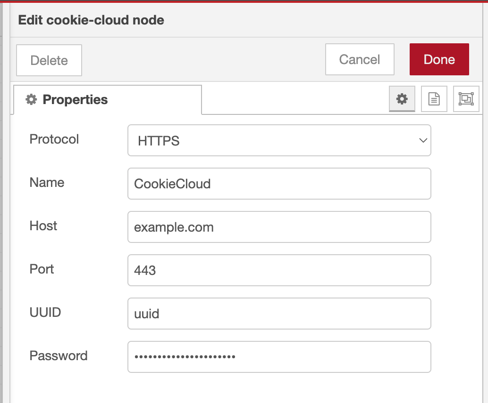
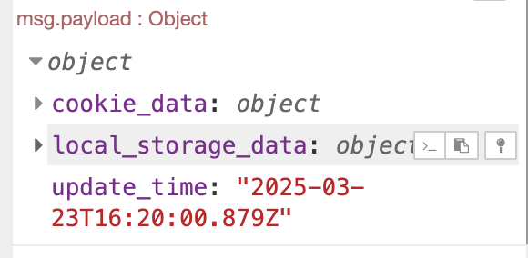

# A Node-RED node to synchronize cookies from a remote cookie cloud server

## Usage

1. Install the node from the Node-RED palette
2. Add the node to your flow
3. Configure the node with the appropriate parameters
4. Decrpted cookies will be stored in the `msg.payload`

## Parameters

- `Protocol`: The protocol to use for the connection.
- `Host`: The host of the server, DO NOT include `http://` or `https://`.
- `Port`: The port of the server.
- `UUID`: The UUID of the server.
- `Password`: The password of the server.

## Example

